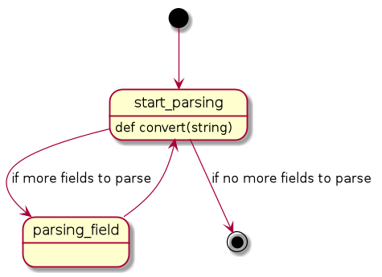
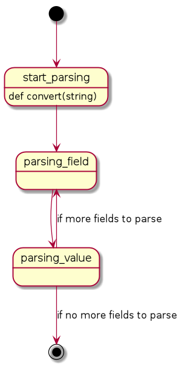
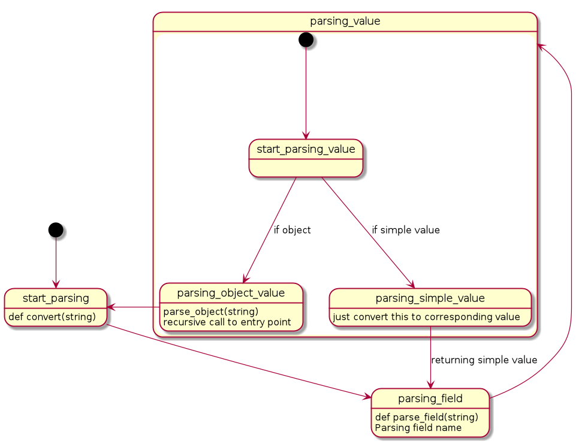
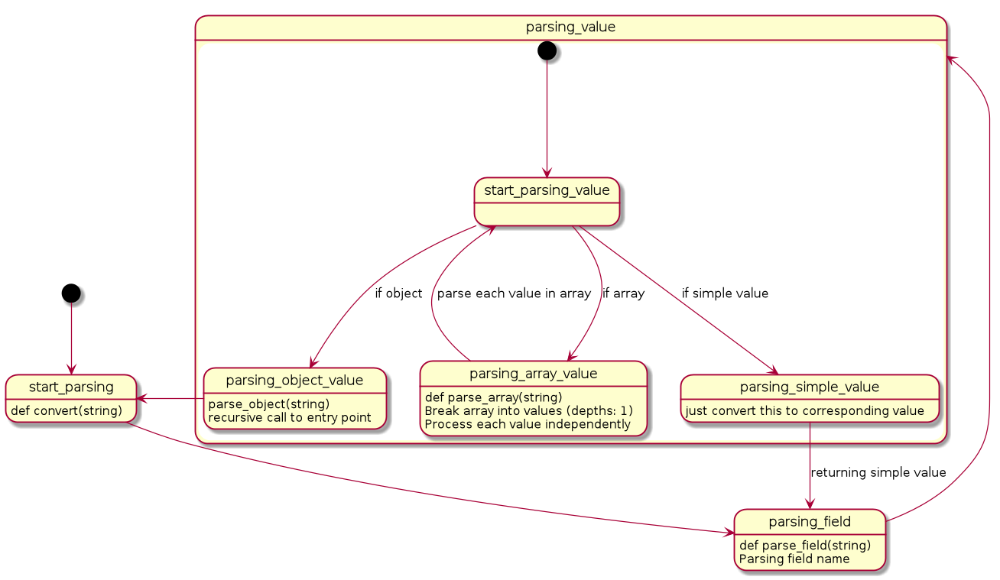

# json_converter
Repository with very naive JSON parser implementation (for education purposes)

# Implementation description
As a first step we try to write an algorithm that will be able to parse simple unnested JSON:
```python
def test_should_parse_simple_json():
    simple_json = '{"key1" : 1.1 , "key2":true, "key3"  :false, "key4": "i am string", "key5": 1 }'

    result = convert(simple_json)

    assert result == {"key1": 1.1, "key2": True, "key3": False, "key4": "i am string", "key5": 1}
```

First step would to learn how to parse field names. We read the JSON string from left to right and look for `"` symbols, which we treat as start of field name, which we them read symbol by symbol until we meet another `"`, after which we save field in name in `result` dict and we do this until string is read.

Maybe this diagram would help as well:


Second step is to parse values as strings. For this we look for `:` symbol as soon as we have read a field name. When we meet `:` - it means the value has started, so we can read it symbol by symbol until we meet either `,` (which means there's another field to read) or `}` (which means end of an object reached).



```python
def test_should_parse_nested_json():
    simple_json = '{"key1" :1.1, "key2": true, "key3": {"key": {"key": "value"}}, "key4": "i am string", "key5": 1}'

    result = convert(simple_json)
    print(result)
    print({"key1" :1.1, "key2": True, "key3": {"key": {"key": "value"}}, "key4": "i am string", "key5": 1})

    assert result == {"key1" :1.1, "key2": True, "key3": {"key": {"key": "value"}}, "key4": "i am string", "key5": 1}
```

Third step is to learn how to read nested objects. For this we use recursion - we simply read nested object as string and them pass it to `convert` again. Neat thing, isn't it?



```python
def test_should_parse_json_with_arrays():
    simple_json = '{"key1" : [3, {"key": {"key": [1,2]}, "key1": 1},1], "key2": 2}'

    result = convert(simple_json)
    print(result)

    assert result == {"key1": [3, {"key": {"key": [1,2]}, "key1": 1}, 1], "key2":2}


def test_should_parse_json_with_nested_arrays():
    simple_json = '{"key1":[3, [1,2], {"key": {"key": [1,2]}, "key1": 1},1], "key2": 2}'

    result = convert(simple_json)
    print(result)
    print({"key1":[3, [1,2], {"key": {"key": [1,2]}},1], "key2": 2})

    assert result == {"key1":[3, [1,2], {"key": {"key": [1,2]}, "key1": 1},1], "key2": 2}
```

Finally, we need to know how to parse arrays. Arrays are just several values, separated by `,`. We know how to parse values, so we just look for when we parse value `[` and if we meet it - we realise we have array of values instead of one value. For nested arrays we use recursion again!



Bonus:
There's a rather obvious bug in the implmentation. Can you spot it? Can you fix it?
